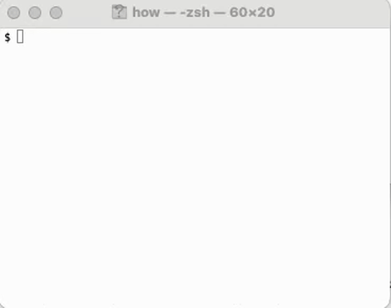

# how

A command-line assistant for zsh. Describe what you want to do in plain English, and `how` generates the shell command for you — ready to execute or edit. When a command fails, `fix` suggests the corrected version.

<center></center>

## Setup

Add the following to your `.zshrc`:

```zsh
source /path/to/how.zsh
```

### Requirements

- zsh
- Ruby
- [Codex CLI](https://github.com/openai/codex) (`codex` command)

## Usage

### how

```
how <what you want to do>
```

The generated command appears at your prompt. Press Enter to run it, or edit it first.

```
how do I find all TODO comments in this project
how do I list files sorted by size
how do I compress this directory into a tar.gz
```

### fix

```
fix [optional instructions]
```

Fixes or modifies the previous command. Without arguments, it diagnoses and corrects the failure. With arguments, it modifies the command as instructed (e.g., `fix sort by date`).

```
$ gti status
zsh: command not found: gti
$ fix
# `gti` is a typo — replacing with `git`.
git status             # ← appears at your prompt, ready to run
```

When running inside [tmux](https://github.com/tmux/tmux) or [GNU screen](https://www.gnu.org/software/screen/), `fix` can read the recent terminal output to see error messages, helping it diagnose problems more accurately.
